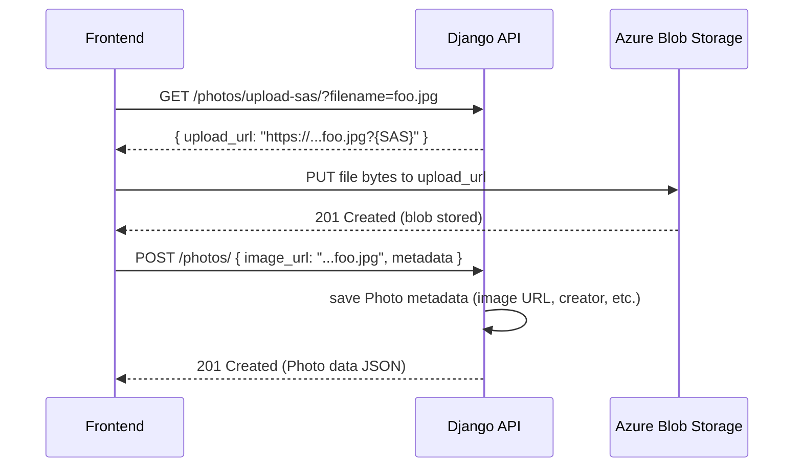
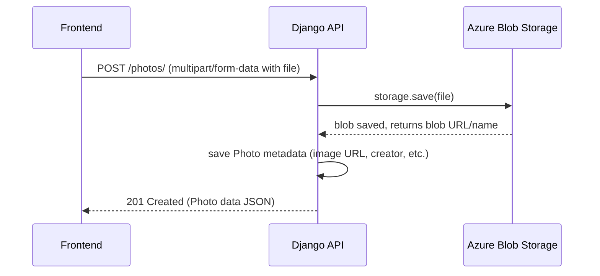

# Askus API

## Set Up Locally

The following steps will show how to setup locally

### Setting up environment

> **Note:** Conda is a contained environment this allows you to have dependancies that you will use for this project that will not clash with other versions of packages you may have installed. This is an important concept so make sure this is clear.

1. Install conda by following [these](https://conda.io/projects/conda/en/latest/user-guide/install/index.html) steps. This will allow you to have all of the required dependancies installed loacally to start development.
2. In your terminal run <code>conda env create -f environment.yml</code> to build the conda environment.
3. If you are using vscode, check the <code>vscode_extensions</code> file. That has all of the the extension you may need to have a good dev experience. If you discover others please add them to the file.

At this point your environment should be set up.

### Setting up project

1. clone this repository. In your terminal and directry of your choosing <code>https://github.com/AskusFam/reimagined-octo-palm-tree.git</code>
2. Open the project in vscode by using this comand <code>code reimagined-octo-palm-tree</code> This will open the project.
3. activate the conda environment <code>conda activate local_testing</code>
4. You can now run the the server and ensure the project was set up successfully. run <code> python manage.py runserver</code>

### Making contributions

1. create a new branch
2. make changes
3. push to the remote repository on github <code>https://github.com/AskusFam/reimagined-octo-palm-tree.git</code>
4. create a pull request

### Design Decisions

Below are some design discussions being had.

#### Photo Uploading Flow

Option 1:

Option 2:

